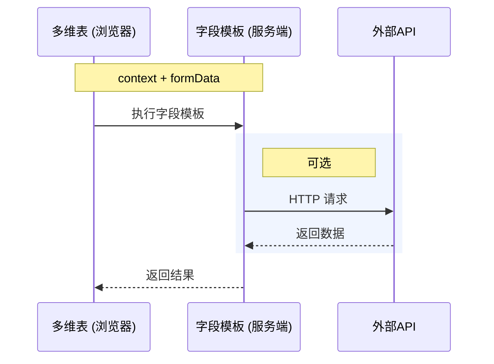

# 多维表字段模板开发指南

Faas 类型的字段模板支持通过代码，调用三方 API，灵活地实现自定义的业务功能。例如：你可以使用「发票识别」这个字段模板，选择要识别的发票字段，通过 AI 的能力，提取出发票的内容。

## 基础介绍

字段模板 FaaS 版是多维表字段级开放能力，支持开发者将垂直场景的应用能力，融入多维表构建的业务系统。

其支持通过代码，调用三方 API，灵活地实现自定义的业务功能。

对开发者而言，字段模板插件本质是一个 Nodejs 函数。在执行时，会将当前行的指定字段数据作为输入，开发者执行自定义业务逻辑后，返回对应的单元格值。多维表服务将单元格值实际写入多维表，并渲染在用户界面中。

每一条记录的函数执行相互独立，仅支持获取当前行信息。



## 项目结构
项目的目录结构为：

```typescript
field-decorator-demo
├── package.json
├── config.json // 本地调试授权时的配置文件
├── src
│   └── index.ts // 项目入口文件
└── tsconfig.json
```

你就可以在 `index.ts`去实现字段模板的 UI 配置和逻辑

## 字段模板的结构

字段模板主要由 `formItems`、`execute` 和 `resultType` 3 个属性组成，他们分别描述了插件的入参、实际的执行逻辑和返回结果。

| 字段模板属性 | 代码示例 | 说明 |
| --- | --- | --- |
| `formItems` | ```typescript<br>{<br>  // ...<br>  formItems: [<br>    {<br>      key: 'link',<br>      label: t('link'),<br>      component: FormItemComponent.FieldSelect,<br>      props: {<br>        mode: 'single',<br>        supportTypes: [FieldType.Link],<br>      },<br>      validator: {<br>        required: true,<br>      }<br>    },<br>  ],<br>}<br>``` | `formItems`描述了字段模板的 UI 表单，字段模板运行时，表单数据会作为 `execute` 参数的入参 |
| `resultType` | ```typescript<br>{<br>  // ...<br>  resultType: {<br>    type: FieldType.Object,<br>    extra: {<br>      properties: [<br>        {<br>          key: 'id',<br>          type: FieldType.Text,<br>          title: 'id',<br>          hidden: true,<br>        },<br>        {<br>          key: 'url',<br>          type: FieldType.Text,<br>          title: t('url'),<br>          primary: true,<br>        },<br>        {<br>          key: 'name',<br>          type: FieldType.Text,<br>          title: t('name'),<br>        },<br>      ]<br>    }<br>  },<br>}<br>``` | `resultType`描述了字段模板的字段类型，例如 Text 表示结果是一列文本 |
| execute | ```typescript<br>{<br>  // ...<br>  execute: async (context, formData) => {<br>    return {<br>      code: FieldExecuteCode.Success,<br>      data: {<br>        id: 'xxx',<br>        url: 'xxx',<br>        name: 'xxx',<br>      },<br>    };<br>  },<br>}<br>``` |  | 字段模板的运行函数 |